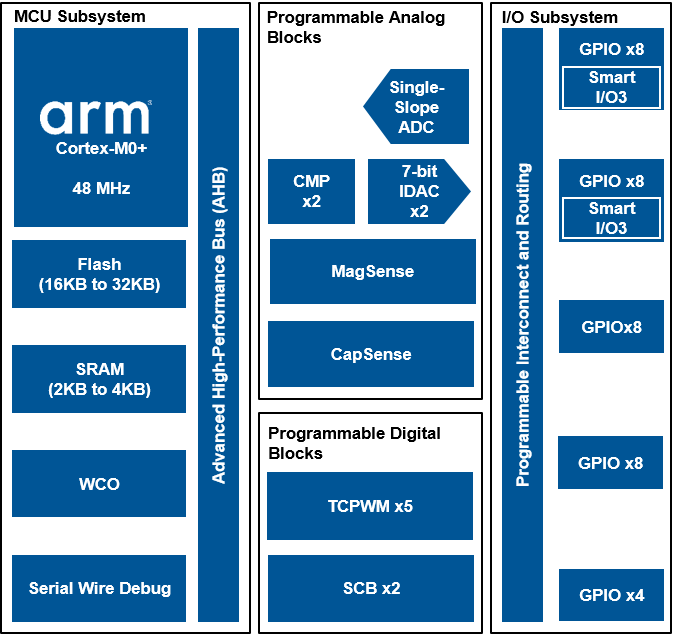

.. CatCutifier documentation master file, created by
   sphinx-quickstart on Wed Apr 24 15:19:01 2019.
   You can adapt this file completely to your liking, but it should at least
   contain the root `toctree` directive....

Cypress's API documentation
=======================================
.. toctree::
   :maxdepth: 2
   :caption: Contents:
   api.rst
:ref:`genindex`

PSoC 6 Dual-Core MCU Architecture
==================================

AWS IOT Structure
====

.. doxygenstruct:: cat
   :members:
   
.. Tip:: Please find more info related to API and more in URL `<https://docs.aws.amazon.com/iot/latest/developerguide/what-is-aws-iot.html/>`_

AWS Set GATT
====

.. doxygenstruct:: SETGATT
   :members:
   
.. note::  This API only works with  **Version 3.x and above** but not with older version of device for reference please visit `<http://docs.oasis-open.org/mqtt/mqtt/v3.1.1/os/mqtt-v3.1.1-os.html/>`_.
   
AWS Discover GATT
====

.. doxygenstruct:: UPDATEGATT
   :members:

.. warning:: note the space between the directive and the text

   